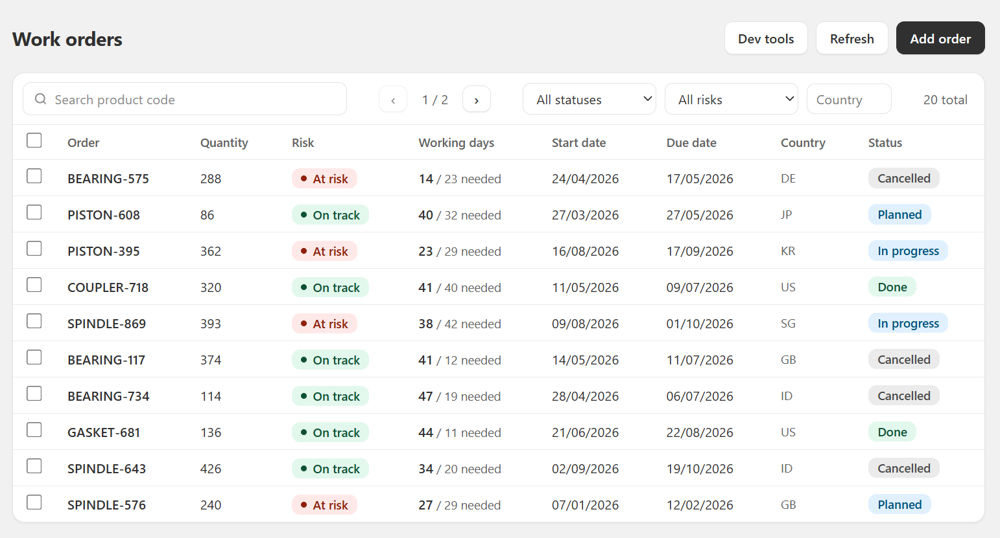
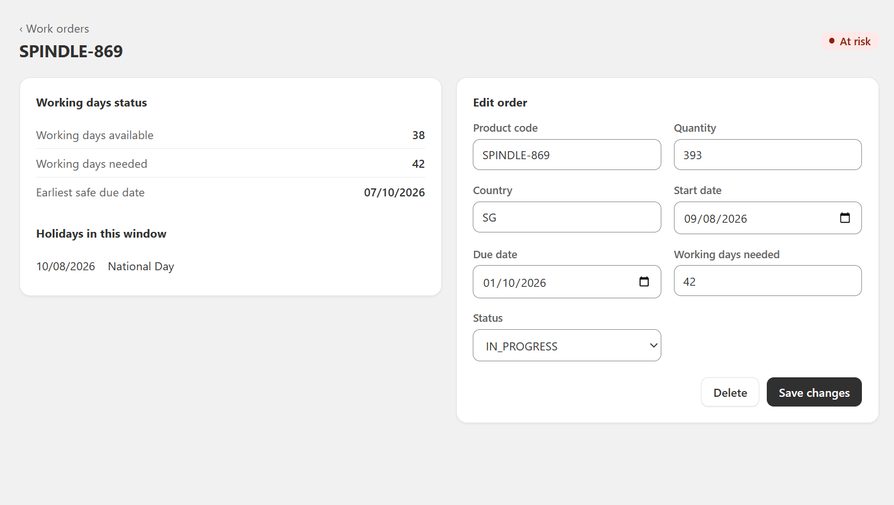
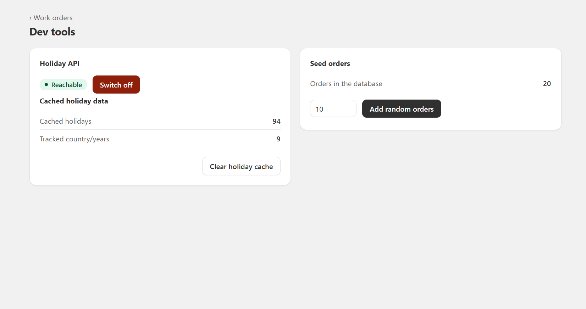

# 🏭📅 Production Order Scheduler

Flags work orders `ON_TRACK` / `AT_RISK` by counting real working days (calendar days minus weekends minus public holidays) between an order's start and due date.

Holidays come from [Nager.Date](https://date.nager.at), are cached in PostgreSQL, and the board keeps working when that API is down.



## 🚀 Run

One command, full stack:

```bash
docker compose up
```

Open http://localhost:5173. API is on 8080.

## 🧱 Stack

| Layer | Choice |
|---|---|
| Backend | Java 21, Spring Boot 3.5.16, Spring Data JPA, Bean Validation |
| Database | PostgreSQL 16, Flyway migrations |
| Frontend | React 18, Vite 5 |
| External API | Nager.Date v3 |

## 🧮 Risk rule

```
working_days = days in [start_date, due_date] inclusive,
               minus Sat, Sun, and public holidays for that country/year

working_days < required_days  ->  AT_RISK
no holiday data at all        ->  UNKNOWN
otherwise                     ->  ON_TRACK
```

- A holiday falling on a weekend is not subtracted twice.
- Windows spanning two calendar years load and merge both years.
- Flags are stored **and** recomputed on every read

## 🏗️ Architecture

Single Spring Boot app. The `order` / `holiday` services are split to separate responsibility.

| Package | Responsibility |
|---|---|
| `order` | Owns `work_order`. CRUD, filtering, paging, and applying the risk rule. Asks `HolidayService` for the working day count and never touches Nager or the holiday tables |
| `holiday` | Owns `holiday_cache` and `holiday_sync`. Fetching, caching, staleness, fallback, and the working day calculation. Only `HolidayService` and its result types are public, so the boundary is enforced by the compiler |
| `common` | Cross cutting concerns: RFC 7807 error handling and the pagination envelope |
| `dev` | Demo controls for the fallback and for seeding data. Gated by a property |

## 🛡️ Holiday cache and fallback

Per country and year:

| Step | Condition | Result |
|---|---|---|
| 1 | Last success within TTL (30d) | `CACHE_FRESH`, no HTTP call |
| 2 | Last attempt failed, inside backoff (15m) | Skip call |
| 3 | Otherwise call Nager | `LIVE`, rows replaced |
| 4 | Call failed or skipped, rows exist | `CACHE_STALE`, real flag kept |
| 5 | Nothing cached | `UNAVAILABLE`, weekends only, flag `UNKNOWN` |

- Every network failure is handled inside the Nager client
- Timeouts: 2s connect, 3s read.
- Only nationwide holidays are used (`global == true`, `types` contains `Public`).

## 🗄️ Schema

| Table | Columns | Function |
|---|---|---|
| `work_order` | `id`, `product_code`, `quantity`, `country_code`, `start_date`, ... | The orders themselves, plus the stored `risk_flag` |
| `holiday_cache` | `id`, `country_code`, `holiday_year`, `holiday_date`, `holiday_name`, ... | One row per cached public holiday |
| `holiday_sync` | `country_code`, `holiday_year`, `last_attempt_at`, `last_success_at`, `last_outcome` | Fetch state per country and year: cached, empty, or failed |

### Why `holiday_sync` was added

| Fact | Why it is needed |
|---|---|
| A fetch returned zero rows (`EMPTY`) | Nager 404s on countries it does not cover. Otherwise "no rows" means both "never fetched" and "fetched, got nothing", so that country is re-fetched forever |
| An attempt failed (`FAILED`) | Enables the retry backoff, so an outage does not cost a 3s timeout on every request |

## 🌐 API

| Method | Path | Notes |
|---|---|---|
| `POST` | `/api/orders` | 201, full validation |
| `GET` | `/api/orders` | Paged, filters below |
| `GET` | `/api/orders/{id}` | 404 if missing |
| `PATCH` | `/api/orders/{id}` | Partial update, PATCH semantics |
| `DELETE` | `/api/orders/{id}` | 204 |
| `DELETE` | `/api/orders?ids=1,2,3` | Bulk, max 100 |

Query params on list: `search`, `status`, `countryCode`, `riskFlag`, `page`, `size`, `sort`.

- `search` matches product code only, case-insensitive substring.
- `countryCode` is a case-insensitive substring.

All errors are RFC 7807 `application/problem+json`, with field errors keyed by field name:

```json
{ "status": 400, "detail": "request validation failed",
  "errors": { "countryCode": "must be a 2-letter ISO country code" } }
```

## ✅ Scope covered

| Priority | Item |
|---|---|
| P0 | Create and list orders, validation, 404 |
| P0 | Fetch holidays from the open API |
| P0 | Cache in DB, only call when uncached or stale |
| P0 | Working days plus risk flag on a React board |
| P0 | Board still loads when the API is down |
| P1 | `docker compose up` for the whole stack |
| P1 | Update and delete orders |
| P1 | Filter by status, country, risk |
| P1 | Show holidays inside the window |
| P2 | Unit tests for working days and cache fallback, 34 tests |
| P2 | Scheduled refresh of cached holidays, 03:00 daily |
| P2 | Cross-year windows |
| P2 | Suggest earliest safe due date |

## ➕ Extras

**Pagination**
- Server-side, 10 per page, capped at 100.
- Response is a custom envelope (`content`, `page`, `size`, `totalElements`, `totalPages`, `hasNext`).

**Bulk delete**
- Select rows with checkboxes, then delete them in one request.
- Does not fail if one row was already deleted. Returns `{requested, deleted}`.

**Order detail page**
- Route `/orders/{id}`, deep linkable.
- Shows working days available vs needed, the holidays inside the window, and the earliest safe due date.



**Dev tools at `/dev`**
- Built to demonstrate the P0 fallback without unplugging anything.
- Disable with `scheduler.dev-tools.enabled=false`.

| Control | Effect |
|---|---|
| Switch holiday API off | Simulates a down Nager API |
| Switch back on | Clears the retry backoff to immediately see effect |
| Clear holiday cache | Empties `holiday_cache` and `holiday_sync` |
| Add random orders | Seeds db with random orders |



**To demo the fallback:** switch the API off, clear the cache, reload the board. Every order becomes `UNKNOWN` with weekends-only working days and the board still loads.

## 🧪 Tests

```bash
cd backend && ./mvnw test
```

| Class | Covers |
|---|---|
| `WorkingDayCalculatorTest` | Weekend and holiday exclusion, weekend holidays not double counted, year boundaries, due date suggestion |
| `HolidayServiceTest` | All five fallback steps, `EMPTY` vs `FAILED`, backoff, cross-year merge |
| `WorkOrderServiceTest` | Risk rule including the `working_days == required_days` boundary, validation, 404 |

## ⚙️ Configuration

| Key | Default |
|---|---|
| `holiday.nager.base-url` | `https://date.nager.at` |
| `holiday.nager.connect-timeout` | `2s` |
| `holiday.nager.read-timeout` | `3s` |
| `holiday.cache.ttl-days` | `30` |
| `holiday.cache.retry-backoff` | `15m` |
| `holiday.cache.refresh-cron` | `0 0 3 * * *` |
| `scheduler.dev-tools.enabled` | `true` |